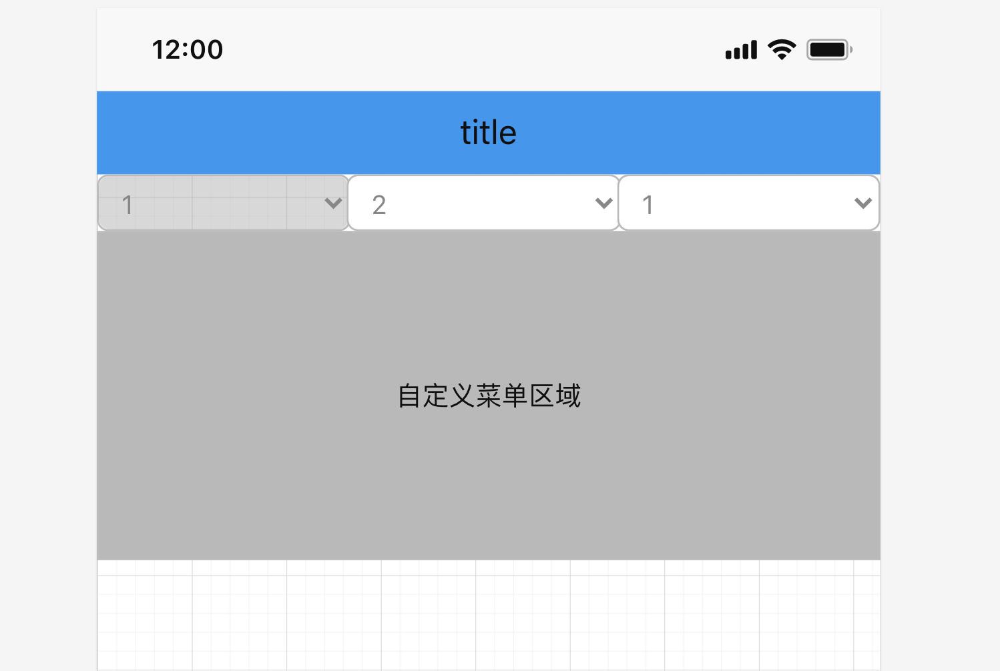
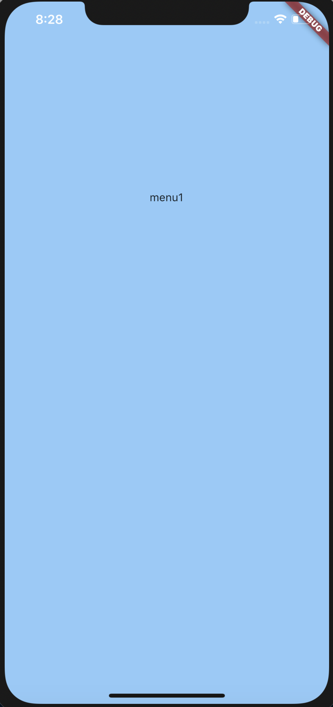
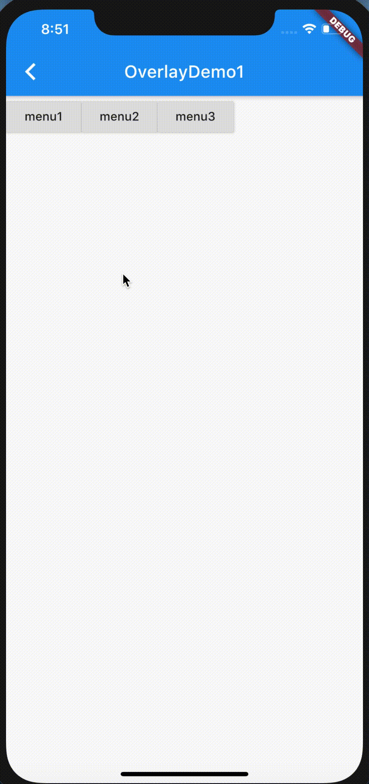
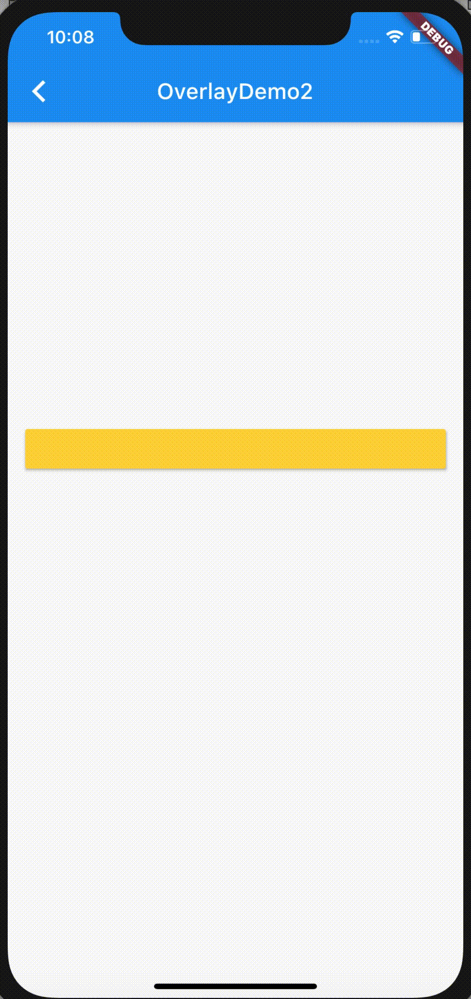

# flutter自定义弹窗(一)：overlay
> [lzyprime 博客 (github)](https://lzyprime.github.io)  
> 创建时间：2020.08.20  
> qq及邮箱：2383518170  

## λ: 

> ***当前flutter版本：1.20.2***



需求如图(画的示意图)，点击按钮弹出菜单区域，点击另外按钮时，关闭当前菜单同时打开对应菜单。

按说下拉菜单应该用 `DropDownButton` 或者 `PopupMenuButton`之类的, 但是有几个条件满足不了：

1. 菜单宽度占满屏幕。
2. 其他按钮可以响应点击。

尺寸，这两个按钮实现太难或者不可，底层做了尺寸限制。

点击效果，这两个按钮弹出效果用的`PopupRoute`, 就像平时跳新页面时`Navigator.of(context).push(MaterialPageRoute(...))` 一个道理，差别是`PopupRoute`是透过的，下层的Widget仍可见。这一效果是因为成员变量`opaque`为`false`。
所以当点击 “第二个按钮所在位置” 时，并不会响应，顶多关闭当前菜单，因为按钮属于下层Widget，点击时其实是点击的“菜单所在页面”的空白区域。

`Dialog` 弹窗也是用这个实现的。底层通过`Navigator.of(...).push<T>(_DialogRoute<T>(...))` 显示`Dialog`, `_DialogRoute` 继承自`PopupRoute`

`Route` 是另外的知识点，另作总结。

## overlay

看了看`Tooltips`的实现，底层用的`Overlay`。因为`Tooltips`只能显示字符串，如果能自定义内容就好了。

`Overlay`本身继承自`StatefulWidget`，所以是可以直接拿来创建widget。但是我们上层一般都是用的 `WidgetApp` 或者 `MaterialApp` 组件，这两个组件里的 `Navigator` 会创建个 `Overlay` 来管理路由。也就是说树的上层节点已经有了，所以我们可以通过 `Overlay.of` 拿到上层的`OverlayState`:

```dart
class Overlay extends StatefulWidget{
    ...
    static OverlayState of(
        BuildContext context, {
        bool rootOverlay = false,
        Widget debugRequiredFor,
      })
    ...
}
// rootOverlay: 
// 值为false, 就近查找，找到树中最近的节点; 
// 如果为true, 则去找最顶层的节点。
```


```dart
class OverlayState extends State<Overlay> with TickerProviderStateMixin {
    /// 存储所有的OverlayEntry
    final List<OverlayEntry> _entries = <OverlayEntry>[];

    /// 计算OverlayEntry的插入位置
    int _insertionIndex(OverlayEntry below, OverlayEntry above) {
        if (below != null) return _entries.indexOf(below);
        if (above != null) return _entries.indexOf(above) + 1;
        return _entries.length;
    }

    /// 添加一个OverlayEntry， 在`_insertionIndex(below, above)`
    /// OverlayEntry里可以放个[Positioned]来确定位置。
    void insert(OverlayEntry entry, { OverlayEntry below, OverlayEntry above })

    /// 同insert，添加多个
    void insertAll(Iterable<OverlayEntry> entries, { OverlayEntry below, OverlayEntry above })

    /// 更新当前的Overlayentry。将newEntries更新旧有的部分
    /// 将旧有未更新的部分，添加到`_insertionIndex(below, above)`
    void rearrange(Iterable<OverlayEntry> newEntries, { OverlayEntry below, OverlayEntry above }){
        final old = LinkedHashSet<OverlayEntry>.from(_entries);
    
        setState(() {
          _entries..clear()..addAll(newEntriesList);
          old.removeAll(newEntriesList);
          _entries.insertAll(_insertionIndex(below, above), old);
        });
    }

}
```

再往下就是渲染层render的实现，`_Theatre` 维护个特殊的`Stack`
```dart
class _Theatre extends MultiChildRenderObjectWidget
```

## 自定义弹出框 OverlayEntry

```dart
  OverlayEntry({
    @required this.builder,
    bool opaque = false,
    bool maintainState = false,
  })
```

由于`Overlay`底层是个特殊`Stack`, 所以`OverlayEntry`里可以放`Positioned`, 可以`Positioned.fill`看一下可控范围:



满屏。用`Positioned`控制布局位置和大小，这就是另外的事情了。

关闭`OverlayEntry`需要调用自身的`remove()` 方法。注意页面切换，页面关闭等等情况，都要自己处理。

```dart
final overlayEntry = OverlayEntry(...);

overlayEntry.remove();
```

## demo

- [仓库地址 https://github.com/lzyprime/flutter_demos/tree/flutter_overlay](https://github.com/lzyprime/flutter_demos/tree/flutter_overlay)

```bash
git clone -b flutter_overlay https://github.com/lzyprime/flutter_demos.git
```

### demo1: 菜单弹窗


关于怎么确定按钮下方的坐标，老生常谈。

### demo2: 跟随按钮滚动



一个部件跟随另一个部件滚动，要用到 `CompositedTransformTarget` 和 `CompositedTransformFollower`，通过`LayerLink`绑定在一起。

```dart
const CompositedTransformTarget({
    Key key,
    @required this.link,
    Widget child,
  })

const CompositedTransformFollower({
    Key key,
    @required this.link,
    this.showWhenUnlinked = true,
    this.offset = Offset.zero,
    Widget child,
  })

  // link: LayerLink, Target 和 Follower 设置同一个LayerLink实现跟随
  // showWhenUnlinked: 当Target不存在时，是否还显示
  // offset: 相对于Target左上角坐标进行偏移
```

```dart
// example
CompositedTransformTarget(
                link: _layerLink,
                child: RaisedButton(
                  color: Colors.amberAccent,
                  key: _buttonKey,
                    onPressed: () {
                  if (_overlayEntry != null) {
                    _overlayEntry.remove();
                    _overlayEntry = null;
                    return;
                  }
                  final buttonSize = (_buttonKey.currentContext.findRenderObject() as RenderBox).size;

                  Overlay.of(context).insert(_overlayEntry = OverlayEntry(
                      builder: (context) => Positioned(child: CompositedTransformFollower(
                        link: _layerLink,
                        showWhenUnlinked: false,
                        offset: Offset(0, buttonSize.height),
                        child: Container(color: Colors.blue),
                      ),width: buttonSize.width,
                        height: 300,
                      )));
                }),
              ),
```

这只是demo, 细节忽略

## ～λ:

`Overlay`自由灵活，但是需要自己维护窗口关闭和显示的时机，处理不当，容易出bug。所以看需求而定，非要用的话，，***谨慎***。

另外，这篇文章从7.26就开始写，写了一半。如今8.20了才完工。看源码学东西其实很快，但是做这种总结，要花好多功夫，可能比学习的过程还要麻烦。

我还有很多东西没总结，但是顾虑花功夫在总结上有多大的用处。这让我想起了我之前搞得linux shell， 之前做后端和运维的时候，shell脚本非常熟练，从dev到外网全套工具链和自动化基本都是我写的，可现在不怎么碰之后，写之前我得先想想，不能顺手就来，了。

总结，我只能尽力而为了，有空就搞吧。只有足够的积累，才会有值得总结的东西。