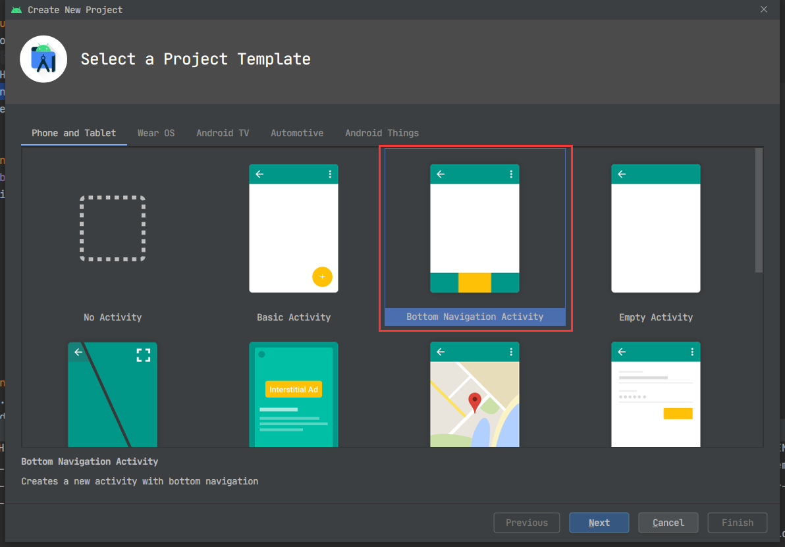
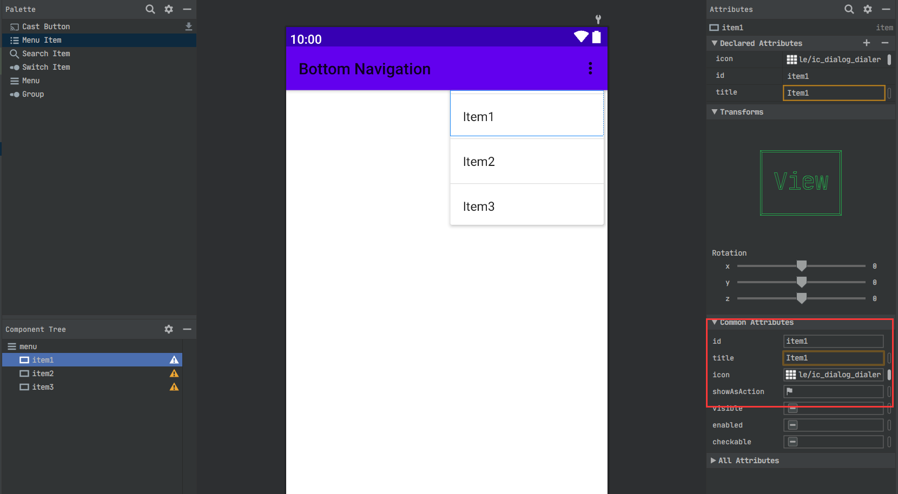
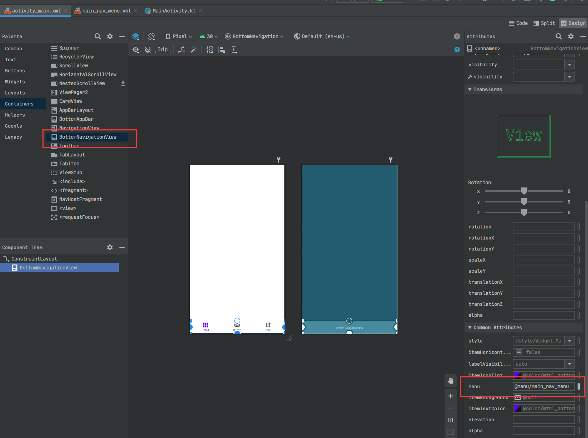
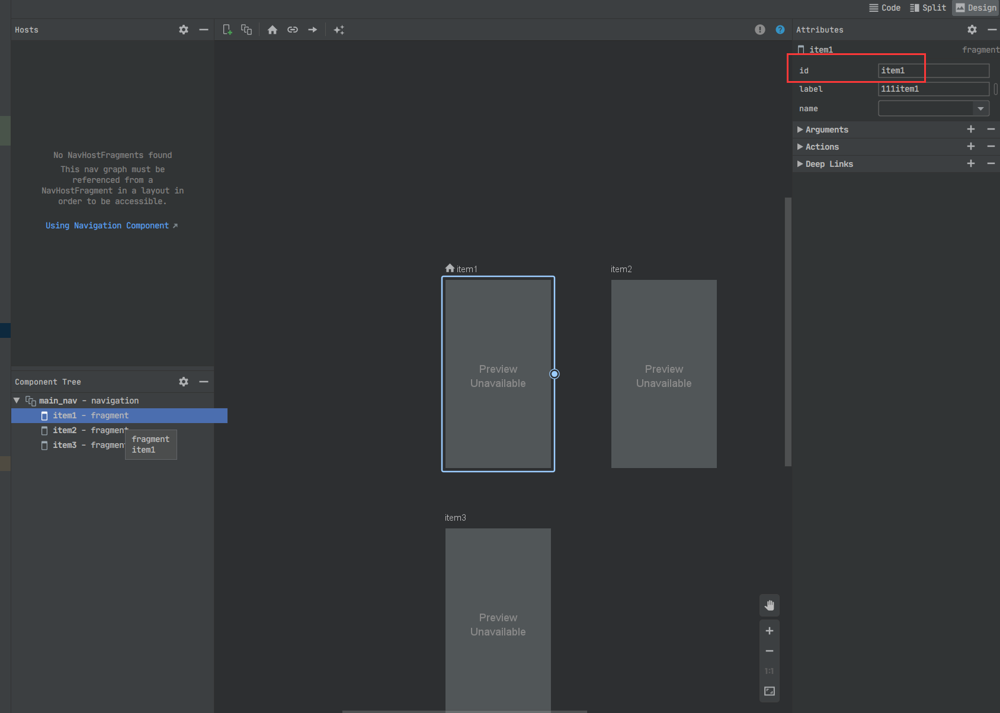

# Android 底部导航栏+页面切换

> [lzyprime 博客 (github)](https://lzyprime.github.io)   
> 更新时间: 2020.12.21  
> 创建时间：2020.11.25  
> qq及邮箱：2383518170  

## [kotlin & android 笔记](https://lzyprime.github.io/kotlin_android/kotlin_android)

---

## 更新

### 2020.12.21 解决 ***“在item2页面点击返回键会返回item1, 而非退出”*** 问题

之前笔记里（[android navigation组件](https://lzyprime.github.io/kotlin_android/android_navigation)）记录整个导航组件时, 其中关于自定义返回导航只是简单一提， 并用于在`MainActivity`的回调里整体组织路由。

[提供自定义返回导航 官网文档](https://developer.android.google.cn/guide/navigation/navigation-custom-back?hl=zh-cn)

给`Item2, Item3`页面注册返回事件， `addCallBack`用`(LifecycleOwner, OnBackPressedCallback)`版本, 会检测生存期，在页面被销毁时自动删掉回调。`OnBackPressedCallback` 构造函数传入 `Boolean` 表示回调初始是否开启（`isEnable`）, 之后可以调用它的 `setEnable` 来改变状态。 

```kotlin
// 仓库已经更新
class Item2Fragment: Fragment(R.layout.item2_fragment){
    override fun onCreate(savedInstanceState: Bundle?) {
        super.onCreate(savedInstanceState)
        requireActivity().onBackPressedDispatcher.addCallback(this, object :OnBackPressedCallback(true){
            override fun handleOnBackPressed() {
                requireActivity().finish()
            }
        })
    }
}
```

-------
# 原文：

## λ：

```bash
# android bottom navigation demo
# 仓库地址: https://github.com/lzyprime/android_demos
# branch: bottom_navigation

git clone -b bottom_navigation https://github.com/lzyprime/android_demos
```

底部导航配合多页面切换是常见逻辑，微信，qq，抖音，淘宝等等，常见app里几乎都有这种设计。

底部导航栏涉及到图标和标题在点击时的变化（颜色，大小，选中与未选中图标变化）

而上方的页面切换有两个常用方案：

1. 用之前说过的 **[navigation组件](https://lzyprime.github.io/kotlin_android/android_navigation)**

2. **[ViewPager2](https://developer.android.google.cn/guide/navigation/navigation-swipe-view-2)**


参考 [使用 NavigationUI 更新界面组件](https://developer.android.google.cn/guide/navigation/navigation-ui)。 会发现用`navigation组件`实现这套东西时可以一行代码搞定。甚至在 *`创建新Android Activity`* 时提供了生成版本：



这本身就可以当个demo。包含了底部栏如何配置，NavHost怎么设置。而且其中的Fragment还有`ViewModel`。

但有一个问题就是每次切换页面，Fragment都是重新构建的，就算数据可以在`ViewModel`活着，但是其他状态还是需要自己维护，比如列表滑动位置。

所以改用`ViewPager2`， 通过设置`offscreenPageLimit`来缓存页面。`ViewPager2`底层是`RecyclerView`, 用来替代之前的`ViewPager`, 尽力保持两版接口一致，同时解决之前遗留的很多棘手问题。

## 1. 底部导航栏：`BottomNavigationView`

- 创建新的`android Resource file`, 类型选择`menu`。 添加`menuItem`



- 在`activity_main.xml`添加`BottomNavigationView`控件，同时设置`menu`参数，之前设置的`menuItem`标题和图标会在底部栏直接显示。同时可以通过底部栏的`itemIconTint`等参数，设置选中态与未选中态的区别



## 2. 页面切换：

### 方案1: `navigation`

- 添加 `NavHost`。如 [navigation组件](https://lzyprime.github.io/kotlin_android/android_navigation) 中方式，添加导航图与目的地。

- **注意`id`与`menu`中相同，`navController`通过`id`将导航图与底部栏链接**



```kotlin 
// MainActivity
class MainActivity : AppCompatActivity() {
    override fun onCreate(savedInstanceState: Bundle?) {
        super.onCreate(savedInstanceState)
        setContentView(R.layout.activity_main)

        val navHostFragment = supportFragmentManager.findFragmentById(R.id.mainNavHost) as NavHostFragment
        mainBtmNavView.setupWithNavController(navHostFragment.findNavController())
    }
}
```

点击底部栏便可以切换页面。

### 方案2: `ViewPager2`

点击第一页按钮，跳转新的`Activity`，将页面上方替换为`ViewPager2`, 其他不变。

- `ViewPager2` 设置 `adapter`, 负责页面切换和组织(`FragmentStateAdapter`)。
- `ViewPager2` 设置 `offscreenPageLimit`， 起到缓存作用
- `ViewPager2` 注册 `OnPageChangeCallback`，页面滑动切换时回调，相当于`ViewPager`中`OnPageChangeListener`。 页面切换完成时，设置底部导航栏对应切换。
- 如果不想滑动切换页面, 设置 `ViewPager2` 的 `isUserInputEnabled = false`, 不必注册回调
- 底部导航栏设置点击事件，`ViewPager2`跳转对应页面。

打印log验证页面是否保活。

```kotlin
class SecondaryActivity : AppCompatActivity() {

    private val fragments = arrayOf(Item1Fragment(), Item2Fragment(), Item3Fragment())
    private val itemIds = arrayOf(R.id.item1, R.id.item2, R.id.item3)

    override fun onCreate(savedInstanceState: Bundle?) {
        super.onCreate(savedInstanceState)
        setContentView(R.layout.activity_secondary)

        secondaryVP.adapter = object : FragmentStateAdapter(supportFragmentManager, lifecycle) {
            override fun getItemCount(): Int = fragments.size
            override fun createFragment(position: Int): Fragment = fragments[position]
        }
        // 页面预加载
        secondaryVP.offscreenPageLimit = fragments.size

        // 若不想滑动切换页面时设置
        //secondaryVP.isUserInputEnabled = false
        secondaryVP.registerOnPageChangeCallback(object : ViewPager2.OnPageChangeCallback() {
            override fun onPageSelected(position: Int) {
                secondaryBtmNavView.selectedItemId = itemIds[position]
            }
        })

        secondaryBtmNavView.setOnNavigationItemSelectedListener {
            secondaryVP.currentItem = itemIds.indexOf(it.itemId)
            true
        }
    }
}
```