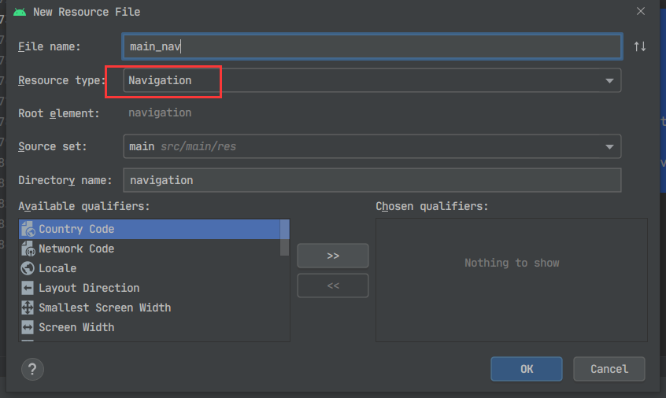
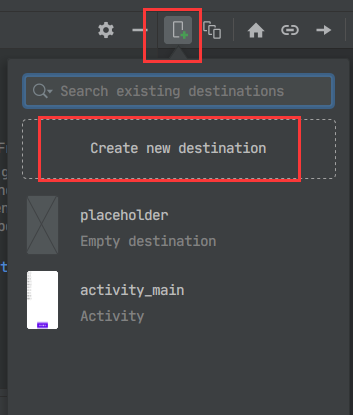
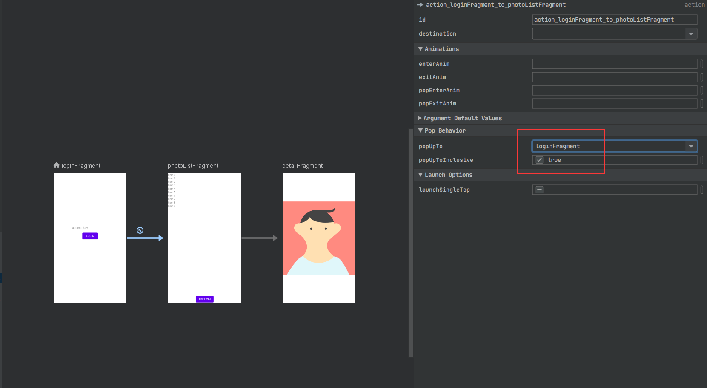
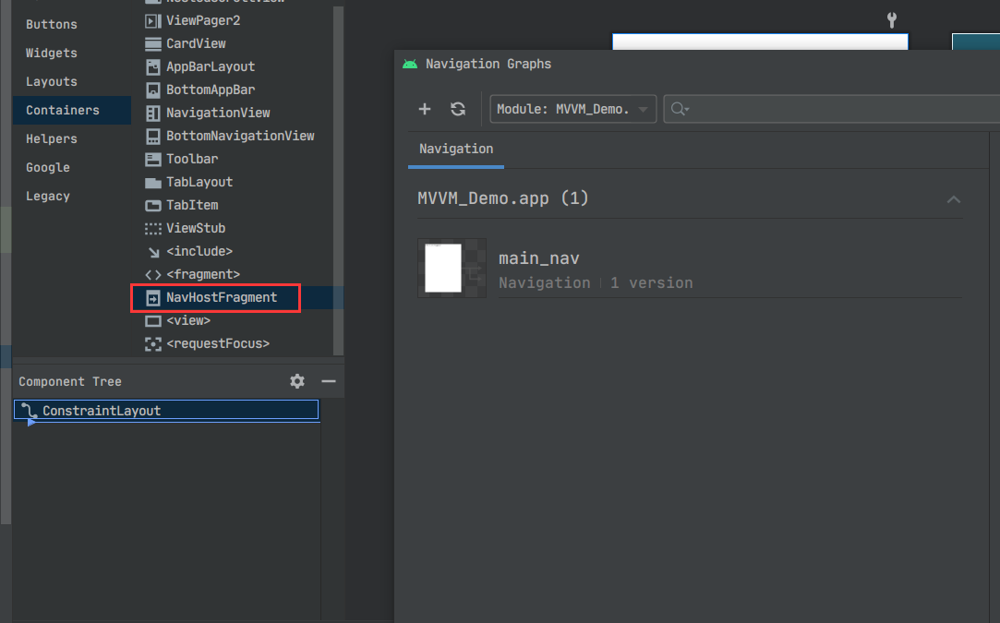
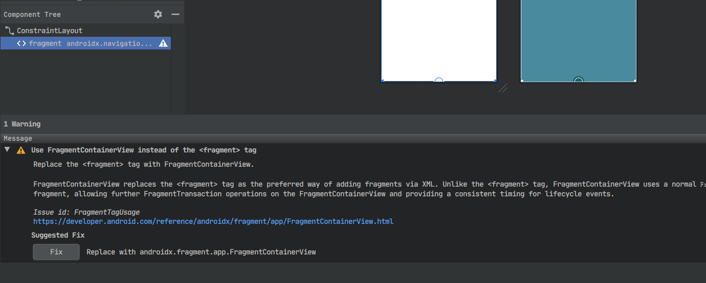
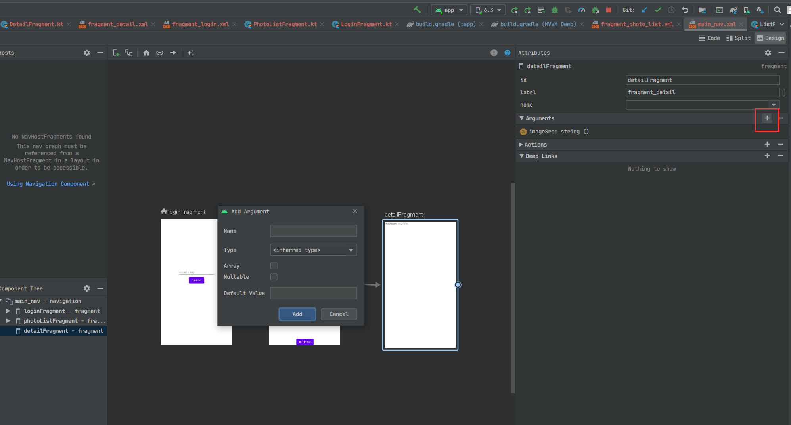

# Android navigation组件

> [lzyprime 博客 (github)](https://lzyprime.github.io)   
> 创建时间：2020.11.24  
> qq及邮箱：2383518170  

## [kotlin & android 笔记](https://lzyprime.github.io/kotlin_android/kotlin_android)

---

## λ：

`navigation 组件` 是 `Android Jetpack`重要组成部分，推出3年左右，2018谷歌I/O大会也曾介绍过。主要用于组织`Fragment`，通过`Fragment`来实现不同内容片段的显示。包括同级之间切换，不同级之间跳转(如 列表item跳详情页)，代替以往跳转`Activity`的方式，推出`单Activity模式`。 

**[navigation 官网地址](https://developer.android.google.cn/guide/navigation?hl=zh-cn)**

***与`Activity`相比好处：***

1. 拿到同一份`Activity ViewModel`。 `ViewModel` 以`Activity`为单位共享，同一`Activity`下的`Fragment`可以拿到同一份`ViewModel`，所以如果直接跳转`Activity`数据共享要自己解决，传递或者全局缓存里取，同时还要考虑副本一致性，也就是我在一个页面修改数据，其他用到此数据的页面也应该同步修改。

> `flutter Navigator1.0`里以`Route`组织页面，用`Provider`插件实现状态管理时，除非把`Provider`包在的`MaterialApp`的外层，否则，跳转其他`Route`就无法通过`Provider.of(context)`获取，数据处理就如同`Android Activity`, 包在最外层好使是因为`MaterialApp`生成时会构造一个`Navigator`来组织所有页面。通过`List<_RouteEntry> _history`和`GlobalKey<OverlayState> _overlayKey`保存信息。所以所有页面都是`MaterialApp`的子节点。  
>
> 最近的`flutter 1.22`推出`Navigator2.0`, 可以用`List<Page<dynamic>> pages`组织页面，也就类似`Android navigation`组件，`flutter Page`好比`Android Fragment`

2. 导航图可以靠可视化工具拖框完成。每一个页面称作“目的地”， 通过之间连线、设置参数来实现页面跳转约束，同时可以设置过渡动画等。所有导航资源存在资源文件夹下的`navigation`文件夹里。也支持`Kotlin DSL`代码完成导航设置。

3. `Safe Args`传递数据。[Safe Arges 官网地址](https://developer.android.google.cn/guide/navigation/navigation-pass-data?hl=zh-cn#use_keep_annotations)。保证安全的传递数据。

> 有句话： ***"通常情况下，强烈建议您仅在目的地之间传递最少量的数据。例如，您应该传递键来检索对象而不是传递对象本身，因为在 Android 上用于保存所有状态的总空间是有限的。"***, 这同样适用于`flutter`。在`flutter`里并没有太好的副本一致性方案，所以我在`Bean`也就是数据解析时做了缓存，同一数据只会构造一次，之后全从缓存中取或者更新。利用`factory`构造函数将数据缓存、生成、更新、获取等操作隐形，达到简单的`Loc`的效果。(TODO: 有空再总结)

***需要注意：***

1. 系统返回按钮和事件的处理。跳转`Fragment`时，要拦截并设置好`Activity`的返回按钮事件，否则整个`Activity`就关闭了。同时其他组件的状态更新也需要自己维护, 参考：[使用 NavigationUI 更新界面组件](https://developer.android.google.cn/guide/navigation/navigation-ui?hl=zh-cn)

> 这个问题在`flutter Navigator2.0`里同样存在。

2. 同级`Fragment`切换需要重新构建，并不记录状态。通过把当前的`FragmentManager`交给`navigation`来实现页面切换时，每切换一次都要重建`Fragment`。

## demo: 添加登录页，详情页

从之前[demo](https://lzyprime.github.io/kotlin_android/android_mvvm)继续开发。

```bash
# android navigation demo
# 仓库地址: https://github.com/lzyprime/android_demos
# branch: navigation

git clone -b navigation https://github.com/lzyprime/android_demos
```

## 1. 导入

### [使用入门 官网地址](https://developer.android.google.cn/guide/navigation/navigation-getting-started?hl=zh-cn)


如果用`Safe Args`则要在最顶层引入插件，或者用`Bundle`代替`Safe Args`实现传递

```gradle
// project gradle
buildscript {
    repositories {
        google()
    }
    // Safe Args
    dependencies {
        ...
        def nav_version = "2.3.1"
        classpath "androidx.navigation:navigation-safe-args-gradle-plugin:$nav_version"
    }
}
```

```gradle
// module gradle
plugin {
    ...

    id "androidx.navigation.safeargs.kotlin"
}

dependencies {
    ...

    // navigation
    def nav_version = "2.3.1"
    implementation "androidx.navigation:navigation-fragment-ktx:$nav_version"
    implementation "androidx.navigation:navigation-ui-ktx:$nav_version"
    // Feature module Support
    //implementation "androidx.navigation:navigation-dynamic-features-fragment:$nav_version"
    // Testing Navigation
    //androidTestImplementation "androidx.navigation:navigation-testing:$nav_version"
    // Jetpack Compose Integration
    //implementation "androidx.navigation:navigation-compose:1.0.0-alpha01"
}
```


## 2. 导航图与目的地

参考 [设计导航图
](https://developer.android.google.cn/guide/navigation/navigation-design-graph?hl=zh-cn)  和 [条件导航（官网地址）](https://developer.android.google.cn/guide/navigation/navigation-conditional?hl=zh-cn)。

添加新的`android resource`, 类型选择`Navigation`, 同时会生成navigation目录。



点击添加新的目的地(`Fragment`), 如果已经存在，列表里会显示。*注意一定要以`Fragment`为单位*



添加3个目的地。 `LoginFragment`在登录成功后会由`PhotoListFragment`取代，因此要设置`popUpTo`参数。参考[导航到目的地](https://developer.android.google.cn/guide/navigation/navigation-navigate?hl=zh-cn)

每一条导航规则都有自己的id。 用于`NavController.navigate`实现跳转。

`LoginFragment`为起始目的地，名字前会显示“主页”图标。




## 2. 为`Activity`添加`NavHost`

在layout文件中添加`NavHostFragment`, 同时会报一个警告⚠，提示用`FragmentContainerView`作为`Fragment`容器。点击Fix应用该建议。




## 3. 登录功能及`Activity`目的地切换

此时app已经可以启动了，会显示起始目的地也就是`LoginFragment`。

demo用到的[https://api.unsplash.com/](https://api.unsplash.com/)实际只需要access_key, 所以登录页只需要一个输入框和登录按钮。点击登录时会请求列表，若成功则替换为`PhotoListFragment`页。

```kotlin

// LoginFragment

class LoginFragment : Fragment(R.layout.fragment_login) {
    private val viewModel: ListPhotoViewModel by activityViewModels()

    override fun onViewCreated(view: View, savedInstanceState: Bundle?) {
        super.onViewCreated(view, savedInstanceState)
        login_btn.setOnClickListener {
            val text = access_key_eidt_text.text.toString()
            if (text.isEmpty()) {
                Toast.makeText(context, "不能为空!", Toast.LENGTH_SHORT).show()
            } else {
                Net.ACCESS_KEY = text
                viewModel.refreshListPhotos()
            }
        }
    }
}
```

参考[导航到目的地](https://developer.android.google.cn/guide/navigation/navigation-navigate?hl=zh-cn), 用`NavHost`的`NavController`来实现目的地跳转。

参考[使用 NavigationUI 更新界面组件](https://developer.android.google.cn/guide/navigation/navigation-ui)，设置顶部appBar和系统返回事件相应

```kotlin
// MainActivity


@AndroidEntryPoint
class MainActivity : AppCompatActivity() {
    private val viewModel: ListPhotoViewModel by viewModels()
    private var loginSuccess = false
    private lateinit var appBarConfiguration: AppBarConfiguration
    override fun onCreate(savedInstanceState: Bundle?) {
        super.onCreate(savedInstanceState)
        setContentView(R.layout.activity_main)

        val navHost = supportFragmentManager.findFragmentById(R.id.mainNavHost) as NavHostFragment
        val navController = navHost.findNavController()

        appBarConfiguration = AppBarConfiguration(setOf(R.id.loginFragment, R.id.photoListFragment))
        // 顶部appBar
        setupActionBarWithNavController(navController, appBarConfiguration)

        viewModel.listPhotos.observe(this) {
            // 列表不为空,登录成功
            if (!loginSuccess && it.isNotEmpty()) {
                loginSuccess = true
                Toast.makeText(this, "登录成功", Toast.LENGTH_SHORT).show()
                navController.navigate(R.id.action_loginFragment_to_photoListFragment)
            }
        }
    }

    override fun onSupportNavigateUp(): Boolean {
        // 是否显示返回按钮
        return mainNavHost.findNavController().navigateUp(appBarConfiguration)
                || super.onSupportNavigateUp()
    }

    override fun onBackPressed() {
        // 系统返回事件
        if (!mainNavHost.findNavController().popBackStack()) finish()
    }
}
```

## 4. 点击图片进入详情页，利用`Safe Args`传递图片链接

参考[在目的地之间传递数据](https://developer.android.google.cn/guide/navigation/navigation-pass-data?hl=zh-cn), 在导航图编辑页面可视化编辑要传递的参数。

`SpecifyAmountFragmentDirections`, `ConfirmationFragmentArgs`为插件自动生成，可在java(generated)目录找到



```kotlin
//PhotoListFragment 跳转逻辑

class PhotoListFragment : Fragment(R.layout.fragment_photo_list) {
...


                override fun onBindViewHolder(holder: RecyclerView.ViewHolder, position: Int) {
                    val photo = photos[position]

                    with(holder.itemView as ImageView) {
                        Glide.with(this).load(photo.urls.raw).into(this)
                        setOnClickListener {
                            val directions = PhotoListFragmentDirections.actionPhotoListFragmentToDetailFragment(photo.urls.raw)
                            this@PhotoListFragment.findNavController().navigate(directions)
                        }
                    }
                }

...
}
```

如果使用`-ktx`版本，可以用`by navArgs()`来获取传递的参数
```kotlin
// DetailFragment

class DetailFragment : Fragment(R.layout.fragment_detail) {
    private val args by navArgs<DetailFragmentArgs>()

    override fun onViewCreated(view: View, savedInstanceState: Bundle?) {
        super.onViewCreated(view, savedInstanceState)
        Glide.with(imageView).load(args.imageSrc).into(imageView)
    }
}
```

