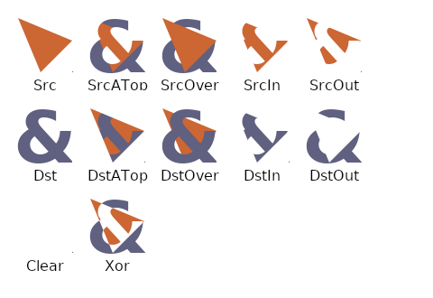
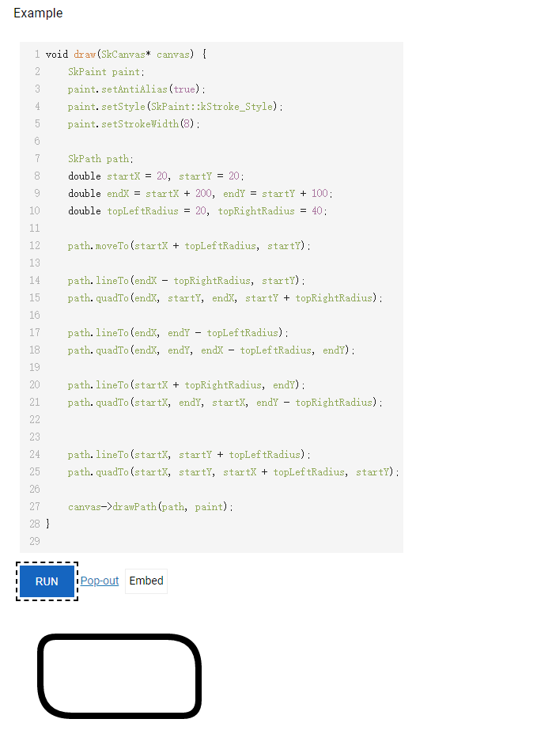

# Android Skia图形库

> [lzyprime 博客 (github)](https://lzyprime.github.io)   
> 创建时间：2020.12.17  
> qq及邮箱：2383518170  

## [kotlin & android 笔记](https://lzyprime.github.io/kotlin_android/kotlin_android)

---

## λ：

`Skia` 是`Android`、`flutter`底层的2D图形库。[Skia 官网](https://skia.org/index_zh)。

2D页面无非就是 **图形(点、线、面)，文字**, 所以`Skia`设计也很简单：

1. 新建`Canvas`, 画布，所有内容画在这上面
2. 通过`Canvas`相关方法画出内容。一般名为`drawxxx()`, 同时要传入一个`Paint`, 也就是画笔样式。
3. 通过`Canvas`相关方法裁剪画布，一般名为`clipxxx()`
4. 内容定位，以`Canvas`左上角为(0, 0)点，向右向下建立(x, y)坐标系。

在官网可以直接体验这些API的C++版本，`android`和`flutter`无非是做一层包装，API大差不差。

用处：

1. 自定义View。 不管是`Android`还是`flutter`想要自定义程度高就离不开直接操作`Render层`。大多数情况的确可以用现有的组件拼凑出想要的效果，但坏处就是损失很多没必要的计算和渲染，而且有些东西生写不出来。`flutter`有很多组件原生设计简单，然后留出`canvas`用来自定义样式。

2. 设计UI时，大概估计一下有多费。尤其是`flutter`, 之前团队项目写出来的列表肉眼可见的掉帧。 我翻看这部分代码，发现大量的无用的组件嵌套，然后频繁的`rebuild`, 宽高很多写死，没有自适应能力。很多UI长一样却不复用，出现`ItemXXXView1, ItemXXXView2`这种东西。所以有一段时间的工作就是删代码，`git`记录我一个月添加了几百行然后删了几千行。

## Canvas

[官网Canvas介绍](https://skia.org/user/api/skcanvas_overview)

### draw
1. `drawColor`: 喷色，不需要传画笔。
2. `drawRect`: 画矩形`Rect`，需要左上角点的坐标和矩形宽高，同时传入一个`Paint`画笔样式
3. `drawRoundRect`: 类似`drawRect`, 不同是可以设置圆角，通过传入圆角的 x, y 偏移值
4. `drawOval`: 椭圆`Oval`，类似`drawRect`。
5. `drawCicle`: 圆`Circle`, 类似`drawRect`。
6. `drawPath`: 画线，需要传入`Path`线的路径和`Paint`画笔。
7. `drawText`: 渲染文字，需要传入文字，起始位置的坐标，`Paint`画笔（主要设置文字样式）。

### clip

`clipxxx`: 裁剪画布，可以传 `Path`, `Oval`, `Rect`, `Circle` 等等

### trans
1. `translate(x, y)`: 平移到x, y。 作为新的原点
2. `scale(x, y)`: 缩放
3. `rotate`: 旋转
4. `save`: 保存当前状态，一般在变换前调用
5. `restore`: 恢复现场，必须保证之前有`save`操作

## Path

[官网Path介绍](https://skia.org/user/api/SkPath_Overview)

除了规则图形外，其他 ***点，线，面*** 都可以通过`Path`画出来。然后就变成了数学题。

***点动成线，线动成面，面动成体***, 当直线长度与画笔粗细相同，就相当于画了一个 ***点***, 而 ***面*** 可以看作多根 ***线*** 并排的结果。

1. `moveTo(x, y)`: 移动到指定坐标
2. `lineTo(x, y)`: 从当前位置向 (x, y) 画直线。 获得线段`(localX, localY) -> (x, y)`
3. `quadTo(x1, y1, x2, y2)`: 贝塞尔曲线。从当前位置经过 (x1, y1) 向 (x2, y2) 画平滑曲线
4. `conicTo`: 类似`quadTo`
5. `addCircle`、 `addRect`等等，添加现成图形
6. `close`: 当前点与起始点连接，形成闭合图形。

## Paint

[官网Paint介绍](https://skia.org/user/api/skpaint_overview)

1. `color`, `width`: 颜色，粗细
2. `style`: 填充方式
    - `fill`: 实心
    - `stroke`: 镂空、描边
3. `fontStyle`: 字号，字体，字宽，字重等等属性。 原生`C++`里通过构造`可绘制字符串(sk_sp<SkTextBlob>)`实现, `android` 封装进了`Paint`里。 `flutter` 封装进了 `TextStyle`。
4. `filter|shader`: colorFilter，maskFilter等等效果

## BlendMode

[官网BlendMode介绍](https://skia.org/user/api/SkBlendMode_Overview)

用于处理两个元素A, B 相交时显示方式。

(A在B上， A在B下， A与B同级) * (交集， 并集， 异或集)。



## 实践

利用`Path`画圆角长方形。

1. 圆角值 `topLeft == bottomRight == 20`, `topRight == bottomLeft == 40`
2. 起始位置(20, 20)
3. 宽 200, 高 100

```c++
void draw(SkCanvas* canvas) {
    SkPaint paint;
    paint.setAntiAlias(true);
    paint.setStyle(SkPaint::kStroke_Style);
    paint.setStrokeWidth(8);
  
    SkPath path;
  	double startX = 20, startY = 20; // (startX, startY) 左上角
  	double endX = startX + 200, endY = startY + 100; // (endX, endY) 右下角
  	double topLeftRadius = 20, topRightRadius = 40;
    
    // 移动起始点到左上角，并空出左上角圆角位置。 所以x坐标要+topLeftRadius
  	path.moveTo(startX + topLeftRadius, startY);
    
    // 横向画线，同理空出右上角圆角位置
  	path.lineTo(endX - topRightRadius, startY);
    // 右上角的圆角， 经过右上角(endX, startY) 向 (endX, startY + topRightRadius) 画曲线
  	path.quadTo(endX, startY, endX, startY + topRightRadius);
  
    // 同理完成右边, 底边，左边的绘制，最后与起始点 (startX + topLeftRadius, startY) 闭合

    // 右边
  	path.lineTo(endX, endY - topLeftRadius);
    // 右下圆角
  	path.quadTo(endX, endY, endX - topLeftRadius, endY);
  
    // 底边
  	path.lineTo(startX + topRightRadius, endY);
    // 底边圆角
  	path.quadTo(startX, endY, startX, endY - topRightRadius);
    
    // 左边
  	path.lineTo(startX, startY + topLeftRadius);
    // 左上圆角
  	path.quadTo(startX, startY, startX + topLeftRadius, startY);
  
    canvas->drawPath(path, paint);
}
```

