# Linux 下 vmware 虚拟机

> [lzyprime 博客 (github)](https://lzyprime.github.io)   
> 创建时间：2019.10.26  
> qq及邮箱：2383518170  

## λ：

### `deepin` 以及 `deepin wine`

在 `windows` 与 `Linux` 之间换来换去，已经成了我的常态。

但是国内软件并没有太多的`linux`版， `qq 微信 企业微信 qq音乐` 等等，当然在这点上， `deepin` 搞得 `deepin-wine` 功不可没，解决了大多数问题。并且可以适配到其他发行版， 这也是解决 `Linux` 下 ***简单*** 运行这些软件的途径之一。`deepin` 的贡献，当然还有`搜狗拼音` 和 `网易云音乐 linux版`（因为曲库问题，不想用）

话又说回来，那只是简单解决。由于机器本身硬件适配问题以及发行版是移植`deepin-wine`, 总会有一些麻烦。 比如，`视频功能` 就不是很好，成功的几率是真小， 由于我机器的原因，就算是用 `deepin` 系统也没见成功。 别的发行版跑 `deepin-wine` 时， 也并不稳定，概率性的崩溃，或者耗资源多， 风扇起飞

当然 `deepin-wine` 仍在发展， 相信以后会越来越好，你问我滋不滋瓷，我当然是滋瓷的嘛。 如果你只是为了简单用一些软件，收发消息之类的，可能`deepin-wine`就足够了， 没必要虚拟机了, 你可以尝试`deepin` 系统， 或者其他发行版下尝试`deepin-wine`。 地址：
[deepin-wine-ubuntu github 地址](https://github.com/wszqkzqk/deepin-wine-ubuntu)

### 2019.10 的官方 `qq linux版`

推出这个版本的因素有很多， 很重要的一点是: 腾讯内部 `linux(ubuntu 18.04)` 入域成功了， 成为很多开发与运维的新选择， 但是对于这些软件， 遇到了同样的问题， `qq 企业微信 微信` 等等，工作要用到， 所以需求提上日程很正常

再就是国内 `linux` 下做开发的多起来， 用户人数增多。 `国产 linux` 也在成长， `deepin` 正在做 `龙芯` 的适配工作（看好deepin）, 所以 `linux` 下还是有潜在市场， 最直接的： `qq 音乐` 与 `网易云音乐`， 为了`qq 音乐`， 我不得不用 `wine` 或者 `虚拟机`

腾讯新出的 `qq linux版`， 虽然异常简陋，也不稳定…… 但这是一个好的开始，应该给点时间，要是真有心做这个工程， 一定会好起来的 （至少紧跟潮流: 扫码登录）

### `virtualbox`

之前， `Linux` 下一直用着 `virtualbox`， 装个 `win7` 再开个无缝模式（就是不显示虚拟机的桌面，只显示虚拟机里的应用窗口，看起来就像与真机同在一个系统下）。 但是还是那个问题, 由于机器的原因， 摄像头是有问题的， 摄像头打开是蓝屏，不走摄像头的控制器。

而且， 对`win 10` 支持并不好，卡的要命。

## 1. 下载 vmware

直接去官网，下载最新版就好了， 要 `登录` 而已， 你就注册一个账号， 它又不能把你怎么样。 包括`windows` 下，下载 `vmware 安装程序` 我也是直接官网下载:

> ### [vmware 官网下载 地址](https://www.vmware.com/cn.html)

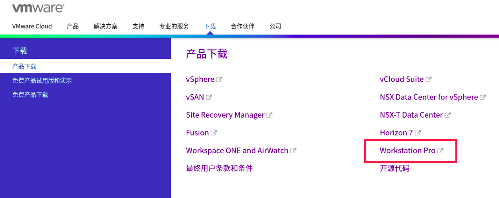 
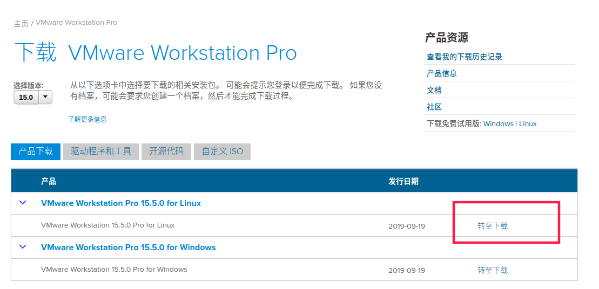

下载完成后得到： 

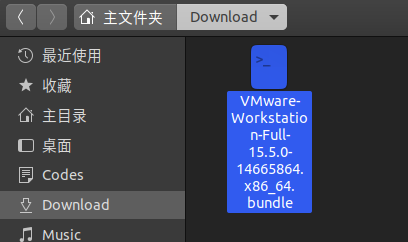

## 2. 安装 vmware

```bash
## 打开终端， 执行该脚本

chmod +x VMware-Workstation-Full-15.5.0-14665864.x86_64.bundle # 给执行权限

sudo ./VMware-Workstation-Full-15.5.0-14665864.x86_64.bundle # 管理员身份

```
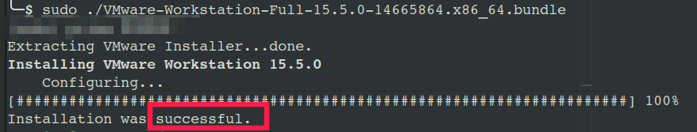

软件列表会多出 3 个：

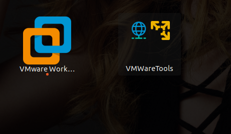

### 其他两个是工具， 我们只需要执行`vmware Workstation`

## 3. 首次打开

 首次打开就像在 `windows` 下一样， 有一些诸如 `是否试试获取更新`， `是否加入xxx体验计划` 以及 `激活码` 等等， 英文关键词大概就能猜出是在问什么， 根据自己习惯做选择

- 第一页，一般是协议，肯定得选 `accept`， 不然没法继续  
- 每次启动时检测更新？  
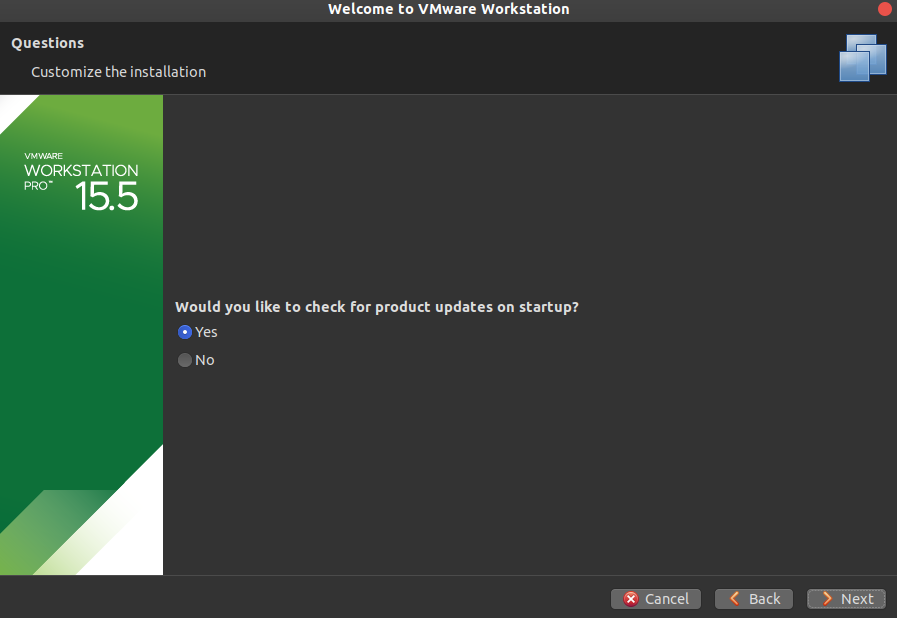  
- 上传问题报告和使用记录帮助软件更好的发展（经典的用户体验计划）？  
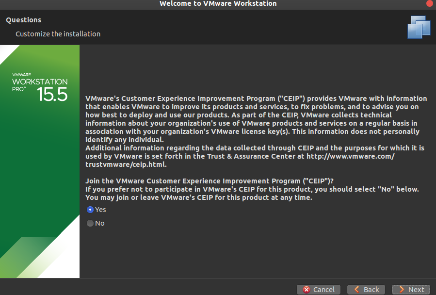    
- vmware 共享主机的存放地址（手填绝对路径）：  
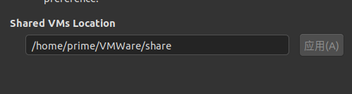  
- vmware server 的用户    
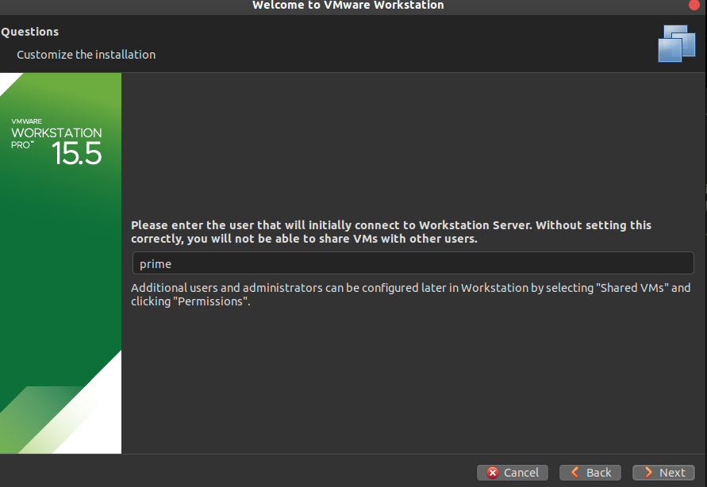   
- vmware server http 端口号  
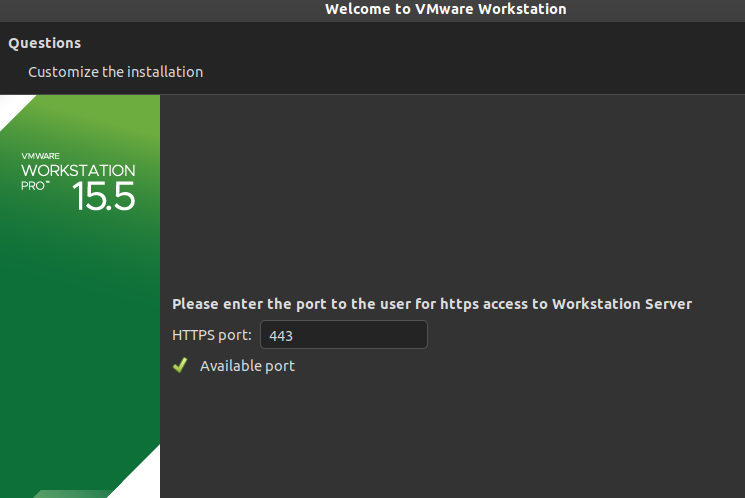  
- 序列码，随便搜一个对应vmware 版本的即可：  
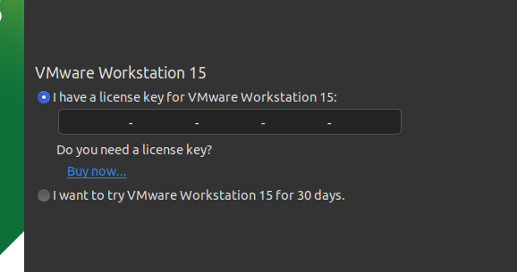  

## 4. 安装完成

如果安装过程配置错了， 或者想修改， 打开软件设置基本都能找到

软件的使用与 `windows` 没什么大区别， 见机行事

## 5. vmare 卸载

打开上边的脚本 `VMware-Workstation-Full-15.5.0-14665864.x86_64.bundle` 看一下源码， 就会发现脚本可以加参数， 而且功能不仅仅基本安装。

```bash
#  打开终端， 执行 -h , 显示帮助文档

./VMware-Workstation-Full-15.5.0-14665864.x86_64.bundle -h
```

#### --uninstall-component=NAME 用来卸载

如果不知道不知道`NAME` 该填什么，可以先空着执行一下， 然后就会有列表：

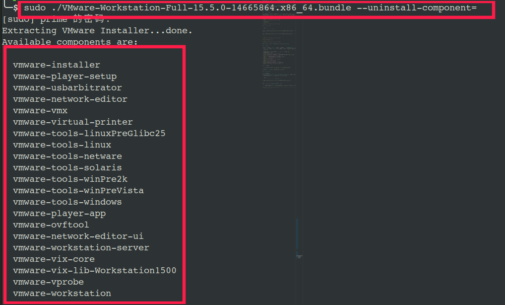

```bash
# 执行卸载，简单粗暴的通配符

sudo   ./VMware-Workstation-Full-15.5.0-14665864.x86_64.bundle   --uninstall-component=vmare-*
```
